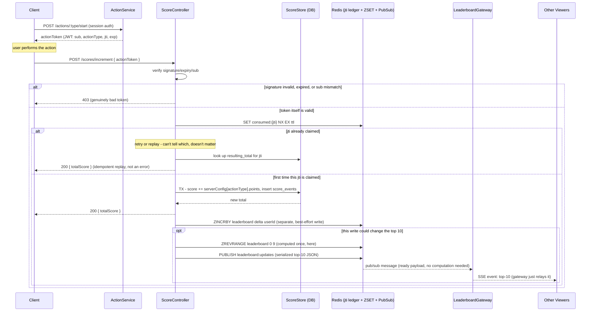

# Problem 6 - Live Scoreboard API Module

Specification for the backend module powering a live top-10 scoreboard. Design document for a backend team to implement, not an implementation.

## Requirements

1. Scoreboard shows the top 10 user scores.
2. Live update for all connected viewers.
3. An out-of-scope "action" increases the user's score on completion.
4. Completing it dispatches an API call to update the score.
5. Malicious users must not increase scores without authorization - the crux: the action is opaque to us, so we can't trust "I did it, give me points" at face value.

## Out of scope

- The action itself, or client/game logic.
- Session auth (login/signup) - assumed already handled; this spec only authorizes the score-increment call on top of an existing session.

## Components

| Component | Responsibility |
| --- | --- |
| `ActionService` | Issues a short-lived, single-use action token (JWT with `jti`) when the client becomes eligible to score. |
| `ScoreController` | Validates the token and applies the score delta. |
| `ScoreStore` | DB (source of truth) + Redis ZSET (leaderboard read cache). |
| `LeaderboardGateway` | SSE gateway; relays pre-computed top-10 payloads from Redis pub/sub. |
| `RateLimiter` | Per-user/IP throttle on `ScoreController`. |
| `AuditLog` | Append-only `score_events`, for after-the-fact review. |

## Data model

```
users(id, username, ...)
scores(user_id PK/FK -> users.id, total_score, updated_at)
score_events(id, user_id, action_jti, delta, resulting_total, created_at, source_ip)
```

Action tokens are stateless JWTs (`sub`, `actionType`, `jti`, `exp`) - no token table. Single-use is enforced in Redis: `SET consumed:{jti} 1 NX EX <ttl>` (TTL = token's own expiry) claims a `jti` exactly once and self-cleans.

## API

### `POST /api/v1/actions/:actionType/start` (optional)

Issues the action token. Skip if the action has no server-verifiable start; then `/increment` must accept whatever proof-of-completion is realistic.

### `POST /api/v1/scores/increment`

```json
// Request
{ "actionToken": "...", "actionType": "puzzle_solved" }
// Response 200
{ "userId": "u_123", "totalScore": 1450 }
```

| Status | Reason |
| --- | --- |
| 401 | Missing/invalid session |
| 403 | Token signature invalid/expired, or `sub` mismatch |
| 429 | Rate limited |

A replayed request for an already-claimed `jti` is **not** a 403 - see step 3.

1. Authenticate the session.
2. Verify token signature, expiry, `sub`.
3. Claim `jti` in Redis (`SET NX EX`). Already claimed → look up `resulting_total` from `score_events`, return `200` (idempotent replay, not an error). First claim → continue.
4. Look up the delta for `actionType` from server-side config - never from the client.
5. DB transaction: `scores.total_score += delta`, insert a `score_events` row.
6. Best-effort `ZINCRBY leaderboard` in Redis (separate write from step 5 - see Hardening below).
7. If this could change the top 10 (already in it, or beats the current #10): compute the top 10 once, `PUBLISH` the payload to `leaderboard:updates`.
8. Return `200 { totalScore }`.

### `GET /api/v1/scores/leaderboard`

`ZREVRANGE leaderboard 0 9 WITHSCORES` - initial load before the SSE stream connects.

### `GET /api/v1/scores/stream` (SSE)

One-way server push, so SSE over WebSocket: no bidirectional handshake, works behind a plain load balancer/proxy (long-lived streaming, no special upgrade). Gateways relay the pre-computed top-10 payload from pub/sub as-is - no per-instance computation. Clients auto-reconnect; send `Last-Event-ID` to resume.

## Flow diagram



## Security (requirement 5)

- Server computes deltas from config, never the client.
- Tokens: single-use, short-lived, signed, bound to `sub`.
- Idempotent replay (see API steps) instead of a false 403 on retry.
- Rate limiting, independent of token checks.
- Audit trail (`score_events`) for investigation/reversal.
- TLS everywhere; `httpOnly`/`SameSite` session cookies if used.

**The gap:** this design guarantees a token was issued once and used once - it can't guarantee the user *earned* it unless the action is verified server-side. A purely client-side action with no server witness can't be fully secured at the API layer; flag this to whoever owns the action.

## Improvements & hardening

- Have the action's own backend call `ActionService` directly once it verifies completion, instead of trusting a client-supplied token blindly - closes the gap above.
- Dual-write drift: `scores` (DB) and `leaderboard` (Redis) update separately - a crash between them leaves the cache stale. Default fix: a periodic job rebuilds the ZSET from `scores`. Escalate to a transactional outbox/CDC only if that staleness window is unacceptable.
- Top-10 computation is centralized once in `ScoreController` (already reflected above) rather than each gateway instance recomputing it - avoids N-times redundant Redis reads at scale.
- Throttle SSE broadcasts under bursty traffic (coalesce to ~1/sec per gateway) rather than pushing every event.
- Rapid actions (sub-second cadence): a per-action `/start` round trip doubles traffic. If measured to matter, move to a session-scoped token plus a sequence number/HMAC chain proving progression, instead of a token per action.
- Anomaly detection: alert on abnormal score velocity or 403 spikes, as a backstop beyond preventive controls.
- Max delta per time window per user, as defense-in-depth if a token check is ever bypassed by a bug.
- SSE gateway scaling needs pub/sub fan-out (already reflected above) and a proxy/LB configured for long-lived streaming (no buffering, generous idle timeout).
- Load/soak test `/scores/increment` and the SSE fan-out path before launch - both get hit continuously, and SSE holds one connection per viewer.
